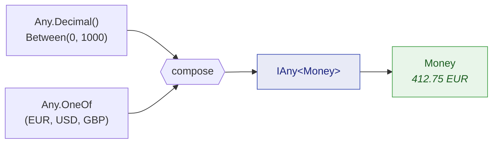

The built-in generators cover primitives. Your code is made of order references, money, customers
and aggregates. This page is about crossing that gap — turning constrained primitives into dummies
for **your** types, without ever producing a value your own constructor would reject.

## `.As(...)`: from a primitive to your type

A value object usually wraps a primitive behind a factory that validates. Constrain the primitive so
that it satisfies the factory, then hand the factory to `.As(...)`:

```csharp
// OrderReference.Create demands the "ORD-" prefix and a length of 12. The constraints
// are chosen so that every drawn string clears that bar — never so an assertion passes.
IAny<OrderReference> anyReference = Any.String()
                                       .StartingWith("ORD-")
                                       .WithLength(12)
                                       .As(OrderReference.Create);

OrderReference reference = anyReference.Generate();
```

`.As(...)` takes an `IAny<TSource>` and a `Func<TSource, TResult>` and returns an `IAny<TResult>` —
a generator like any other, which can be stored, passed around, put in a collection, or made
nullable.

This is the supported route to a type with a stricter contract, and it has a property worth naming:
the factory is your real one. If the constraints are too loose, the factory throws, and you find out
immediately rather than shipping a dummy that could never exist in production.

## `Any.Combine`: several generators into one

When a type needs more than one input, `Any.Combine` draws from each generator and feeds a composer:



```csharp
IAny<Money> anyMoney = Any.Combine(
    Any.Decimal().Between(0m, 1_000m).WithScale(2),
    Any.OneOf("EUR", "USD", "GBP"),
    Money.Create);

Money price = anyMoney.Generate();
```

The composer can be a method group, as above, or a lambda when the shape needs adjusting. Overloads
exist for two through eight generators.

Every operand must actually be **used** by the composer. An operand that is drawn and thrown away is
almost always a mistake — a parameter left unread after a refactor — so it is diagnostic
[JD027](/docs/analyzers/JD027/). When the draw really is deliberate, name the parameter `_` to say
so.

## When eight is not enough

The arity stops at eight on purpose
([ADR-0005](https://github.com/Reefact/just-dummies/blob/lib-v1.0.0-preview.3/doc/handwritten/for-maintainers/adr/0005-cap-any-combine-at-arity-eight.md)). A type needing more
than eight independent inputs is a type that wants intermediate structure, and composing that
structure is both the workaround and the better design:

```csharp
// Compose the parts first...
IAny<Money>          anyPrice     = Any.Combine(Any.Decimal().Between(0m, 1_000m).WithScale(2),
                                                Any.OneOf("EUR", "USD", "GBP"),
                                                Money.Create);
IAny<OrderReference> anyReference = Any.String().StartingWith("ORD-").WithLength(12).As(OrderReference.Create);

// ...then combine the parts, not the primitives.
IAny<string> anySummary = Any.Combine(
    anyReference,
    anyPrice,
    Any.Enum<OrderStatus>(),
    (orderRef, price, status) => $"{orderRef} — {price} — {status}");
```

A composed generator is an ordinary `IAny<T>`, so it feeds another `Combine`, a collection, or an
`.As(...)` exactly like a primitive one does. That is what makes the cap a shape constraint rather
than a ceiling.

## `Any.PairOf` and `Any.TripleOf`

When all you want is the tuple, and no composer would add anything, two shorthands exist:

```csharp
IAny<(int Quantity, decimal UnitPrice)> anyLine = Any.PairOf(
    Any.Int32().Between(1, 100),
    Any.Decimal().Between(0.01m, 500m).WithScale(2));

(int quantity, decimal unitPrice) = anyLine.Generate();

IAny<(Guid, string, OrderStatus)> anyRow = Any.TripleOf(
    Any.Guid().NonEmpty(),
    Any.String().Alpha().WithLengthBetween(3, 20),
    Any.Enum<OrderStatus>());
```

## `.OrNull()`: optional values

An optional field deserves a dummy that is sometimes absent — otherwise the null branch is never
exercised. `.OrNull()` yields `null` about half the time and, otherwise, a value satisfying
everything declared upstream:

```csharp
// Value types: int?, DateTime?, Guid?, an enum...
int?      discount  = Any.Int32().Between(0, 100).OrNull().Generate();
DateTime? cancelled = Any.DateTime().Before(new DateTime(2030, 1, 1)).OrNull().Generate();

// Reference types: a nullable string, or a value object built through .As(...)
string?         note      = Any.String().Alpha().WithLengthBetween(1, 40).OrNull().Generate();
OrderReference? reference = Any.String().StartingWith("ORD-").WithLength(12)
                               .As(OrderReference.Create)
                               .OrNull()
                               .Generate();
```

There are two extension classes behind that single spelling — `NullableExtensions` for value types
and `NullableReferenceExtensions` for reference types — because one overload constrained to `struct`
and another to `class` would collide. You never pick between them: the compiler does, from the type
you are generating.

The null-versus-value decision draws from the same random context as the wrapped generator, so a
seeded run replays it exactly. A `null` draw does not consume a value from the wrapped generator.

## Building a whole aggregate

Putting it together, here is a dummy for a record with three fields, none of which is a bare
primitive at the call site:

```csharp
IAny<Customer> anyCustomer = Any.Combine(
    Any.Guid().NonEmpty(),
    Any.String().Alpha().WithLengthBetween(3, 20),
    Any.String().Alpha().LowerCase().WithLengthBetween(3, 12),
    (id, name, localPart) => new Customer(id, name, $"{localPart}@example.test"));

Customer customer = anyCustomer.Generate();

// A generator is a recipe, so the same one produces a whole list of distinct customers.
List<Customer> customers = Any.ListOf(anyCustomer).WithCountBetween(2, 5).Generate();
```

Keep such a generator in a `static readonly` field of your test class and every test in the file
gets a valid customer for one call — with no shared mutable state, because generators are immutable.
