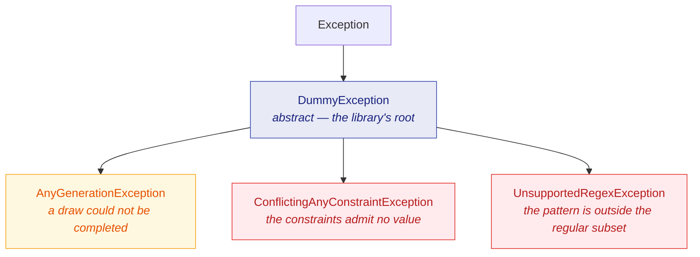

JustDummies would rather refuse loudly than return a value nobody can explain. This page is about
what it refuses, what the exceptions mean, and how to read a message that names both sides of a
contradiction.

## The exception hierarchy



`DummyException` is abstract, so catching it catches everything this library throws and nothing else:

<!-- jd:allow=JD023 -->
```csharp
try {
    int impossible = Any.Int32().Between(1, 10).MultipleOf(50).Generate();
} catch (DummyException exception) {
    Console.Error.WriteLine(exception.Message);
}
```

Ordinary argument mistakes are **not** in that hierarchy. Passing `null` where a generator is
required, or a negative length, throws the usual `ArgumentNullException` / `ArgumentException` —
those are bugs in the calling code, not statements about a constraint set.

## `ConflictingAnyConstraintException`: the constraints admit no value

This is the one you will meet most, and it is a feature rather than a defect. Because values are
built to satisfy the whole specification rather than drawn and filtered, a specification satisfying
nothing is detected instead of looped over:

<!-- jd:allow=JD023 -->
```csharp
// No integer is both above 100 and below 10.
int impossible = Any.Int32().GreaterThan(100).LessThan(10).Generate();
```

**The message names both sides of the conflict.** That is a product guarantee, not an accident of
how the exception happened to be worded: a message saying only "no value is possible" would leave
you re-reading a twelve-call chain to find which two calls disagree.

Conflicts come in a few recognisable shapes:

| Shape | Example |
| --- | --- |
| bounds that cross | `.GreaterThan(100).LessThan(10)` |
| a lattice with no point in range | `.Between(1, 10).MultipleOf(50)` |
| exclusions that empty the domain | `Any.Boolean().Except(true, false)` |
| a length that cannot hold the fragments | `.StartingWith("ORDER-").WithLength(3)` |
| a count no element pool can fill | 100 distinct values from a pool of three |

## Caught at compile time instead

Many of those chains are decidable from constants the compiler can already see, and the analyzers
shipped in the package report them **before** the test ever runs. That is the difference between a
red build and a red test at 3 a.m.:

| Rule | Catches |
| --- | --- |
| [JD014](/docs/analyzers/JD014/) | a constant argument the generator's own guard refuses |
| [JD015](/docs/analyzers/JD015/) | a string chain that throws: fragments too long, or a value set a constraint empties |
| [JD016](/docs/analyzers/JD016/) | collection counts that cannot all hold |
| [JD017](/docs/analyzers/JD017/) | an enum constraint stepping outside the declared members |
| [JD023](/docs/analyzers/JD023/) | an integer chain narrowed to nothing |
| [JD024](/docs/analyzers/JD024/) | a constraint that narrows nothing at all |

The run-time checks stay in place regardless: they cover every argument an analyzer cannot see —
anything computed, read from a field, or passed in as a parameter.

## `AnyGenerationException`: a draw that could not be completed

A few constraints cannot be honoured by construction. Excluding values from a continuous range,
matching a regular expression, and filling a collection with distinct elements all end in the same
place: draw a candidate, check it, and try again if it does not fit.

Left unbounded, that is a loop that may never end. JustDummies bounds it — a fixed number of
attempts, then a refusal:

```csharp
// Two decimal places between 0 and 1 leave 101 candidates; excluding 100 of them leaves one.
decimal[] excluded = Enumerable.Range(0, 100).Select(index => index / 100m).ToArray();

try {
    decimal awkward = Any.Decimal().Between(0m, 1m).WithScale(2).Except(excluded).Generate();
} catch (AnyGenerationException exception) {
    // exception.Seed carries the seed of the run, when one was pinned — so the failure replays.
    Console.Error.WriteLine($"{exception.Message} (seed: {exception.Seed})");
}
```

`AnyGenerationException` carries a nullable `Seed`. When the draw happened inside a reproducible
scope, the seed that produced it is on the exception, so a bounded-redraw failure is as replayable
as any other failure.

Meeting one usually means the specification is tighter than intended rather than that the library
gave up early. Widen the interval, drop an exclusion, or ask for fewer distinct elements.

## `UnsupportedRegexException`: outside the regular subset

`Any.StringMatching` builds a value from the pattern rather than testing candidates against it,
which is why it can guarantee a match. Building requires the pattern to be **regular**, and the
library says so rather than guessing:

```csharp
try {
    // A back-reference is not a regular construct: no finite automaton can carry it.
    string impossible = Any.StringMatching(@"(\w+)\s\1").Generate();
} catch (UnsupportedRegexException exception) {
    Console.Error.WriteLine(exception.Message);
}
```

The supported constructs — and the refused ones — are listed in
[Strings and patterns](/docs/generators/strings/). The decision to parse a regular subset with the
library's own parser, rather than taking a regex-automaton dependency to widen coverage, is
[ADR-0008](https://github.com/Reefact/just-dummies/blob/lib-v1.0.0-preview.3/doc/handwritten/for-maintainers/adr/0008-generate-strings-from-a-home-grown-regular-subset.md).

## Symptom, cause, fix

| Symptom | Likely cause | Fix |
| --- | --- | --- |
| `ConflictingAnyConstraintException` at the arrange line | two constraints disagree | read the message — it names both — and drop the one that is not a domain invariant |
| `AnyGenerationException` after a pause | a bounded redraw exhausted its attempts | widen the domain, or ask for fewer distinct values |
| `UnsupportedRegexException` | the pattern uses a non-regular construct | rewrite it within the regular subset, or build the string with `Any.String()` constraints |
| a value your factory rejects | the constraints are looser than the factory | tighten the constraints until they imply the factory's contract |
| a test that passes on rerun | the failing values are gone | wrap the body in `Any.Reproducibly` so the next failure names its seed |
| a build warning `JD0NN` | a mistake decidable at compile time | open the rule page linked from the diagnostic |
