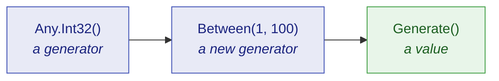

Ten minutes from an empty test project to a test that reads better, covers more, and tells you
exactly how to reproduce itself when it goes red. No prior knowledge of dummy generators assumed.

## What is a dummy?

A **dummy** is a value a test needs but does not care about.

Every test has them. A test about discounts needs an order reference, but any order reference will
do. A test about shipping needs a customer name, but the name is irrelevant. Traditionally those
values get typed in by hand:

```csharp
string reference = "ORD-12345678";
int    quantity  = 3;
```

Hand-picked literals cause two specific problems.

The first is that they **lie about what matters**. A reader cannot tell whether `3` is essential to
the test or whether `7` would do just as well. Every literal looks equally load-bearing, so nobody
dares change one, and the test becomes harder to read than the code it covers.

The second is that they **only ever test one case**. `"ORD-12345678"` never has a leading zero,
never has repeated characters, and is always exactly that. A defect that needs a different shape of
input is a defect this test can never find.

JustDummies replaces the literal with a **declaration of what the value must satisfy**:

```csharp
string reference = Any.String().StartingWith("ORD-").WithLength(12).Generate();
int    quantity  = Any.Int32().Between(1, 100).Generate();
```

Now the test says what it means. The reference must start with `ORD-` and be twelve characters long
because *that is what an order reference is* — and everything else about it is free to vary.

## Install

```bash
dotnet add package JustDummies
```

That is the whole install. The package also carries its 29 analyzer rules inside it, so the guards on
correct usage start working on your next build with nothing further to configure.

## Your first dummy

```csharp
int      quantity  = Any.Int32().Between(1, 100).Generate();
string   name      = Any.String().Alpha().WithLengthBetween(3, 20).Generate();
Guid     id        = Any.Guid().NonEmpty().Generate();
DateTime orderedAt = Any.DateTime().Before(new DateTime(2030, 1, 1)).Generate();
```

Every line follows the same three-step shape, and it is worth naming the steps because the rest of
the library is just more of them.



1. **`Any.Int32()` opens a generator.** A generator is a *recipe* — a description of the values that
   would be acceptable. It is not a value, and no value has been drawn yet.
2. **`.Between(1, 100)` adds a constraint.** It does not modify the generator; it returns a **new**
   generator carrying one more requirement. The original is untouched.
3. **`.Generate()` draws a value.** This is the only step that produces something concrete, and it
   is the only step that involves randomness.

That second point is the one newcomers trip over, so it is worth seeing directly:

```csharp
AnyInt32 anyQuantity = Any.Int32().Between(1, 100);

// Adding a constraint returns a NEW generator; anyQuantity still means "1 to 100".
AnyInt32 anyEvenQuantity = anyQuantity.MultipleOf(2);

int     quantity = anyQuantity.Generate();     // 1..100, odd or even
int evenQuantity = anyEvenQuantity.Generate(); // 1..100, even
```

Because a generator is immutable, you can safely keep one in a field, hand it around, and build
variations from it without any of them interfering.

## A real test, before and after

Here is an ordinary test for a discount rule. The rule is simple: applying a percentage discount to
an amount must never produce a negative price.

Written with literals, it checks exactly one arithmetic case:

<!-- jd:declarations -->
```csharp
public sealed class DiscountTests {

    [Fact]
    public void A_discount_never_produces_a_negative_price() {
        decimal amount     = 100m;
        int     percentage = 20;

        decimal discounted = Discount.Apply(amount, percentage);

        Assert.Equal(80m, discounted);
    }

}

internal static class Discount {

    public static decimal Apply(decimal amount, int percentage) {
        return amount - (amount * percentage / 100m);
    }

}
```

The test name promises something about *every* discount; the body delivers one. Nothing here would
notice a rule that breaks at 100 %, or at an amount of zero.

Written with dummies, the body finally says what the name says:

<!-- jd:declarations -->
```csharp
public sealed class DiscountTests {

    [Fact]
    public void A_discount_never_produces_a_negative_price() {
        // An order amount is non-negative and has two decimal places: that is the domain,
        // not the assertion. A percentage runs from 0 to 100 for the same reason.
        decimal amount     = Any.Decimal().Between(0m, 10_000m).WithScale(2).Generate();
        int     percentage = Any.Int32().Between(0, 100).Generate();

        decimal discounted = Discount.Apply(amount, percentage);

        Assert.InRange(discounted, 0m, amount);
    }

}

internal static class Discount {

    public static decimal Apply(decimal amount, int percentage) {
        return amount - (amount * percentage / 100m);
    }

}
```

Read the comment in that sample again, because it is the single most important habit in this
library:

> **A constraint states an invariant of the domain. It never restates what the test asserts.**

The amount is constrained to be non-negative because *amounts are non-negative*, not because the
assertion would fail otherwise. If you ever find yourself adding a constraint to make an assertion
pass, the constraint is in the wrong place — and usually the assertion has just found a real defect.

## Making a failure reproducible

A test that draws a different value every run is more powerful than one that does not — and it is
only acceptable if a failure can be replayed exactly. That is what `Any.Reproducibly` is for:

```csharp
Any.Reproducibly(() => {
    decimal amount     = Any.Decimal().Between(0m, 10_000m).WithScale(2).Generate();
    int     percentage = Any.Int32().Between(0, 100).Generate();

    Assert.InRange(amount - (amount * percentage / 100m), 0m, amount);
});
```

While the body runs, every draw comes from one pinned seed. If the body throws, the seed is reported
before the failure propagates:

```text
[JustDummies] These arbitrary values were seeded with 1743029518. Reproduce this run with Any.Reproducibly(1743029518, ...).
```

Copy that number in front of the body. Nothing else moves — same test, one argument more — and the
exact run comes back, value for value:

```csharp
Any.Reproducibly(1743029518, () => {
    // the same draws as the run that failed
});
```

Debug against those exact values, fix the defect, then delete the seed so the test varies again.

If you use xUnit v3, the [`JustDummies.Xunit`](/docs/packages/justdummies-xunit/) package does
this for you with a `[Reproducible]` attribute, so no test body needs wrapping by hand.

## Where to go next

| If you want to… | Read |
| --- | --- |
| understand generators properly before going further | [Core concepts](/docs/guides/core-concepts/) |
| replay a failing run, or pin a seed | [Reproducibility](/docs/guides/reproducibility/) |
| build a dummy for one of *your* types | [Composition](/docs/guides/composition/) |
| know what happens when constraints contradict | [Errors and conflicts](/docs/guides/errors-and-conflicts/) |
| look up every constraint on a given type | [Generator reference](/docs/generators/) |
| know why the library refuses some things on purpose | [Design principles](/docs/guides/design-principles/) |
| get a short answer to a specific question | [FAQ](/docs/guides/faq/) |
