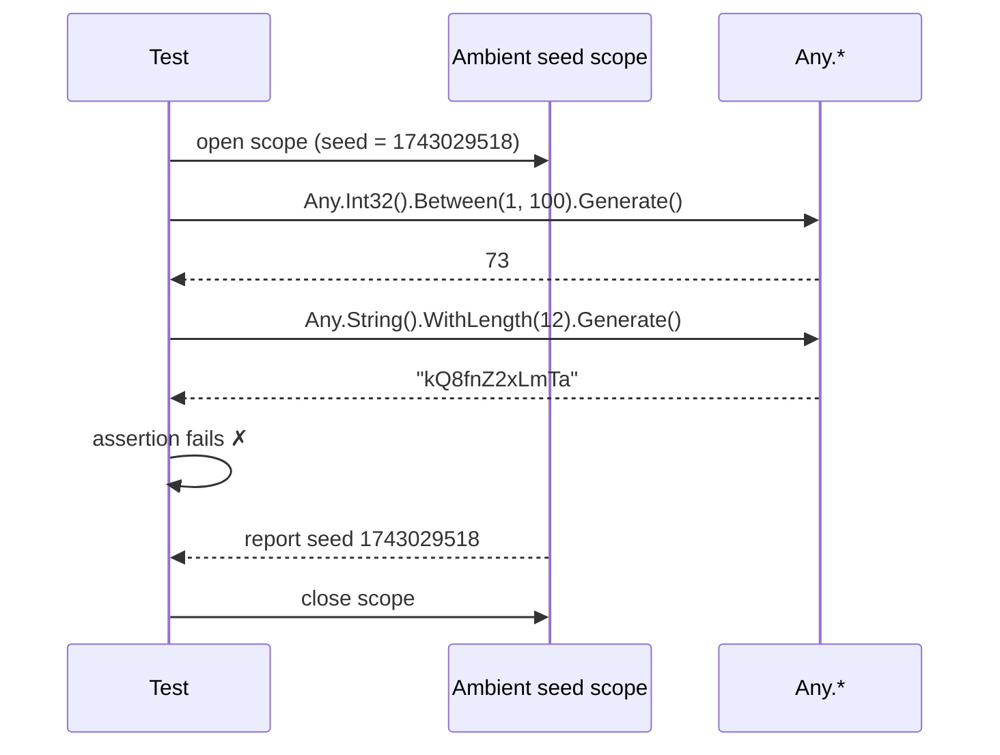
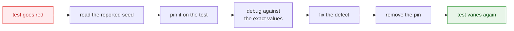

A test that draws a different value every run finds defects a fixed test never would — and is only
worth having if a failure can be replayed exactly. This page is about the mechanism that makes that
true, and about the four ways to reach it.

## Why arbitrary values need a replay button

The objection to random values in tests is a fair one: *a test that fails once and passes on rerun
is worse than no test at all.* It wastes an afternoon and teaches the team to press "retry".

JustDummies answers it by making every run **replayable from a single integer**. Draws come from an
ambient random source pinned to a seed. Vary the seed and the suite explores; report the seed on
failure and any run comes back exactly.



The seed is reported **only when the run fails**. A green suite stays silent.

## `Any.Reproducibly`: one pinned scope per test

Wrap the body of a test and everything drawn inside it comes from one seed:

```csharp
Any.Reproducibly(() => {
    decimal amount     = Any.Decimal().Between(0m, 10_000m).WithScale(2).Generate();
    int     percentage = Any.Int32().Between(0, 100).Generate();

    Assert.InRange(amount - (amount * percentage / 100m), 0m, amount);
});
```

If the body throws, the seed is written out and the original exception propagates unchanged — the
failure you see is still your assertion's, with the seed added beside it:

```text
[JustDummies] These arbitrary values were seeded with 1743029518. Reproduce this run with Any.Reproducibly(1743029518, ...).
```

By default the report goes to `Console.Error`. Pass a second argument to send it somewhere else —
a test framework's output sink, for instance:

```csharp
Any.Reproducibly(
    () => Assert.True(Any.Int32().Positive().Generate() > 0),
    report: message => Console.Out.WriteLine(message));
```

## Replaying a failure

Take the number from the report, pass it to the seeded overload, and the run comes back value for
value:

```csharp
Any.Reproducibly(1743029518, () => {
    decimal amount     = Any.Decimal().Between(0m, 10_000m).WithScale(2).Generate();
    int     percentage = Any.Int32().Between(0, 100).Generate();

    Assert.InRange(amount - (amount * percentage / 100m), 0m, amount);
});
```

The working loop is short, and the last step matters as much as the first:



**Remove the pin once the defect is fixed.** A seed left committed turns the test back into a
one-case test — the very thing dummies were adopted to escape. There is an opt-in analyzer for
exactly this, [JD019](/docs/analyzers/JD019/), which flags a constant replay seed in committed
code; enable it in `.editorconfig` if pins tend to survive review in your team.

## Asynchronous bodies

An `async` body needs `ReproduciblyAsync`, and the returned task **must** be awaited:

```csharp
await Any.ReproduciblyAsync(async () => {
    string reference = Any.String().StartingWith("ORD-").WithLength(12).Generate();

    await Task.Delay(1);

    Assert.StartsWith("ORD-", reference);
});
```

Getting this wrong is silent in the worst way, so two analyzers guard it as **errors**: passing an
`async` lambda to the synchronous `Any.Reproducibly` is [JD001](/docs/analyzers/JD001/) — bound to
an `Action` it becomes `async void` and its assertion failures never reach the runner — and
discarding the task returned by `ReproduciblyAsync` is [JD002](/docs/analyzers/JD002/).

## `Any.UseSeed`: the scope form

When the code to pin cannot be wrapped in a delegate, open a scope instead and dispose it when done:

```csharp
using (IDisposable scope = Any.UseSeed(1743029518)) {
    int quantity = Any.Int32().Between(1, 100).Generate();

    Assert.InRange(quantity, 1, 100);
}
```

This is the form a test-framework adapter uses, because it observes a test through hooks that run
before and after it. It does **not** report the seed on failure — that is `Reproducibly`'s job — so
inside a test body prefer `Reproducibly`.

Discarding the handle leaves the seed pinned for whatever runs next, which is why doing so is
diagnostic [JD004](/docs/analyzers/JD004/). A second overload takes the **replay snippet** an
adapter wants embedded in failure guidance, so the message names the code a reader actually has to
change:

```csharp
using (IDisposable scope = Any.UseSeed(1743029518, "[Reproducible(Seed = 1743029518)]")) {
    Assert.True(Any.Int32().Positive().Generate() > 0);
}
```

## `Any.WithSeed`: an isolated context

`Any.WithSeed(seed)` pins nothing ambient. It returns an `AnyContext` — a self-contained world with
the same factories on it — which is what you want to build deterministic data *outside* a test body,
such as a fixture or a benchmark:

```csharp
AnyContext context = Any.WithSeed(1743029518);

int      quantity  = context.Int32().Between(1, 100).Generate();
string   reference = context.String().StartingWith("ORD-").WithLength(12).Generate();
int      seed      = context.Seed;

// The same seed rebuilds exactly the same data, wherever this runs.
```

Because the context is isolated, values drawn from it are unaffected by any ambient scope — and a
`[Reproducible]` attribute or an enclosing `Any.Reproducibly` does not govern them.

Holding an `AnyContext` in a **static** field is a trap worth naming: interleaved draws from several
tests make neither the sequence nor the multiset stable, which is diagnostic
[JD020](/docs/analyzers/JD020/).

## With xUnit v3: `[Reproducible]`

The [`JustDummies.Xunit`](/docs/packages/justdummies-xunit/) package removes the wrapping
entirely:

<!-- jd:declarations -->
```csharp
public sealed class DiscountTests {

    [Fact, Reproducible]
    public void A_discount_never_produces_a_negative_price() {
        decimal amount     = Any.Decimal().Between(0m, 10_000m).WithScale(2).Generate();
        int     percentage = Any.Int32().Between(0, 100).Generate();

        Assert.InRange(amount - (amount * percentage / 100m), 0m, amount);
    }

}
```

The attribute pins a fresh seed for every test **case** — so each case of a `[Theory]` gets its own
rather than sharing one — and writes the seed to the test's output when, and only when, the test
fails:

```text
[JustDummies] These arbitrary values were seeded with 1743029518. Reproduce this run with [Reproducible(Seed = 1743029518)].
```

Replay by pinning the seed on the attribute, `[Reproducible(Seed = 1743029518)]`. The attribute also
applies to a class or a whole assembly; when several levels apply, the most specific one wins for
the duration of the test and the outer ones are restored afterwards.

## What a seed promises

From `1.0.0-preview.1`, a given seed draws **the same values across every patch and minor release of
a major version**, and a golden master in the test suite enforces it
([ADR-0049](https://github.com/Reefact/just-dummies/blob/lib-v1.0.0-preview.3/doc/handwritten/for-maintainers/adr/0049-replay-a-seed-across-patch-and-minor-versions.md)). A
seed you write down today is still replayable after an upgrade within the same major.

Two limits are worth stating plainly.

**Replay is per sequential run.** Draws are serialised on the random source, so a seed replays a run
whose draws happen in a deterministic order. Work items running in parallel inside one scope
interleave their draws, and the order — hence the values — is not stable between runs. Give each
parallel item its own seed scope; drawing without one is diagnostic
[JD022](/docs/analyzers/JD022/).

**A seed is an identifier, not an assertion.** It exists to bring a run back. Never assert on a
seed, and never build test expectations from one.
