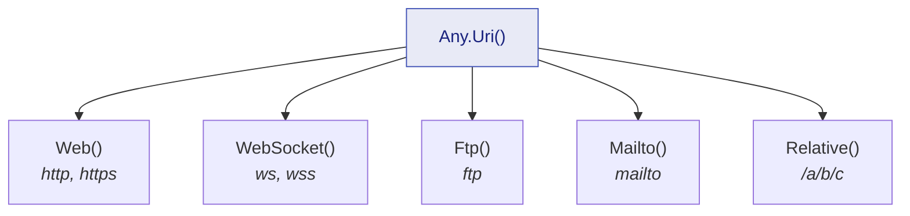

Deux générateurs pour les deux sortes d'identifiants qui apparaissent dans presque tous les tests :
l'opaque, et le structuré.

## Guid

```csharp
Guid id       = Any.Guid().Generate();
Guid nonEmpty = Any.Guid().NonEmpty().Generate();
Guid empty    = Any.Guid().Empty().Generate();        // toujours Guid.Empty
Guid notThis  = Any.Guid().DifferentFrom(Guid.Empty).Generate();
Guid oneOf    = Any.Guid().OneOf(Guid.Parse("11111111-1111-1111-1111-111111111111"),
                                 Guid.Parse("22222222-2222-2222-2222-222222222222")).Generate();
```

`Empty()` mérite sa place parce que `Guid.Empty` est un cas distinct dans la plupart des domaines :
l'identifiant pas encore attribué. Un test couvrant « que se passe-t-il quand l'identifiant
manque ? » se lit mieux en `Any.Guid().Empty()` qu'en littéral, car il reste dans le même vocabulaire
que ses voisins.

`NonEmpty()` en est le miroir, et c'est celui à saisir par défaut : une entité qui existe a un
identifiant, et laisser le tirage errer jusqu'à `Guid.Empty` testerait occasionnellement un état que
votre domaine ne possède pas.

## URI

`Any.Uri()` est le point d'entrée et, non contraint, il couvre tout l'espace d'URI sûr — une URI web,
WebSocket, FTP ou mailto absolue, ou une référence relative :

```csharp
Uri anything = Any.Uri().Generate();
```

Se restreindre à une **famille** renvoie un constructeur n'exposant que les composants que cette
famille possède réellement. C'est tout l'intérêt de cette conception : une combinaison impossible —
un port sur un `mailto:`, un fragment sur une URI WebSocket — ne peut même pas s'écrire.



Chaque composant est tiré parmi les caractères ASCII non réservés et l'URI est assemblée directement :
une valeur est donc valide par construction. Les hôtes internationalisés (IDN) et le schéma `file`
sont volontairement hors du tirage non contraint : ni l'un ni l'autre ne fait l'aller-retour à
l'identique selon la cible, ce qui casserait le contrat de déterminisme.

### URI web

```csharp
Uri page     = Any.Uri().Web().Generate();
Uri secure   = Any.Uri().Web().UsingHttps().WithHost("api.example.com").Generate();
Uri insecure = Any.Uri().Web().UsingHttp().Generate();
Uri deep     = Any.Uri().Web().WithPathSegments(3).Generate();          // /a/b/c
Uri bare     = Any.Uri().Web().WithoutPath().Generate();
Uri onAPort  = Any.Uri().Web().WithPort(8080).Generate();
Uri anyPort  = Any.Uri().Web().WithPort().Generate();                   // un port, non précisé
Uri queried  = Any.Uri().Web().WithQuery().WithFragment().Generate();
Uri withAuth = Any.Uri().Web().WithUserInfo("alice", "secret").Generate();
```

`WithPort()` sans argument demande qu'*un* port soit présent sans dire lequel — la contrainte qu'il
vous faut quand le code testé doit gérer un port explicite mais que le numéro n'a aucune importance.
`WithUserInfo` a trois formes : sans argument, avec un utilisateur, ou avec un utilisateur et un mot
de passe.

### URI WebSocket

```csharp
Uri socket = Any.Uri().WebSocket().Generate();                    // ws:// ou wss://
Uri secure = Any.Uri().WebSocket().UsingWss().WithHost("live.example.com").Generate();
Uri plain  = Any.Uri().WebSocket().UsingWs().WithPathSegments(2).WithQuery().Generate();
```

Une URI WebSocket n'a pas de fragment : il n'y a donc pas de `WithFragment` à appeler.

### URI FTP

```csharp
Uri archive = Any.Uri().Ftp().Generate();
Uri hosted  = Any.Uri().Ftp().WithHost("files.example.com").WithPathSegments(2).Generate();
Uri account = Any.Uri().Ftp().WithUserInfo("alice").WithPort(2121).Generate();
Uri root    = Any.Uri().Ftp().WithoutPath().Generate();
```

### URI mailto

```csharp
Uri mail    = Any.Uri().Mailto().Generate();
Uri toAlice = Any.Uri().Mailto().WithLocalPart("alice").WithDomain("example.com").Generate();
Uri withCc  = Any.Uri().Mailto().WithHeaders().Generate();
```

Un `mailto:` n'a ni hôte, ni port, ni chemin — il a une partie locale, un domaine et des en-têtes
optionnels — et le constructeur expose exactement cela.

### Références relatives

```csharp
Uri relative = Any.Uri().Relative().Generate();
Uri rooted   = Any.Uri().Relative().Rooted().Generate();                    // /a/b/c
Uri deep     = Any.Uri().Relative().WithPathSegments(3).Generate();
Uri queried  = Any.Uri().Relative().WithPathSegments(1).WithQuery().WithFragment().Generate();
```

Une combinaison mérite d'être connue : une référence relative sans segment de chemin, sans requête,
sans fragment et sans racine est la **référence vide**. Elle est licite, et n'est presque jamais ce
qu'un test voulait dire — d'où son propre diagnostic, [JD026](/fr/docs/analyzers/JD026/). C'est la
seule chaîne d'URI dont l'échec atterrit au moment de l'action plutôt qu'à la ligne d'arrangement, et
c'est la raison d'être de l'analyzer.

## Composer un identifiant dans votre propre type

Les deux générateurs alimentent `.As(...)` comme n'importe quel autre :

```csharp
IAny<Customer> anyCustomer = Any.Combine(
    Any.Guid().NonEmpty(),
    Any.String().Alpha().WithLengthBetween(3, 20),
    Any.Uri().Mailto().WithDomain("example.test"),
    (id, name, mail) => new Customer(id, name, mail.ToString()));

Customer customer = anyCustomer.Generate();
```
