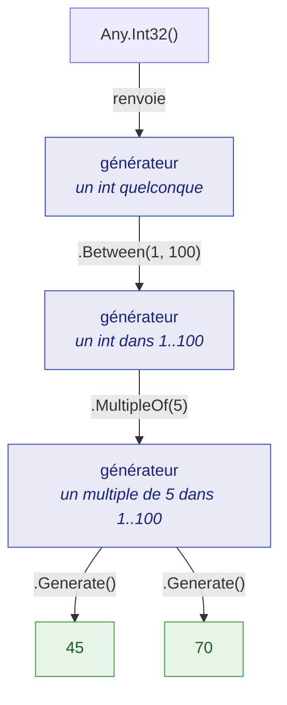
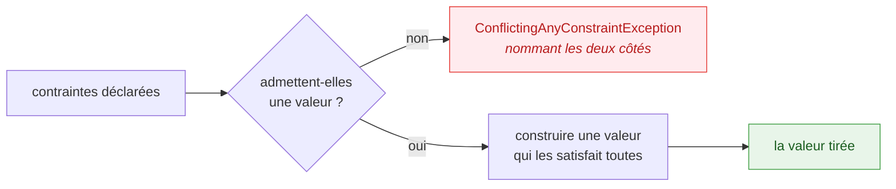

Cinq idées portent toute la bibliothèque. Une fois acquises, chaque générateur de la référence se
lit de la même façon, et les surprises cessent.

## Un générateur est une recette, pas une valeur

`Any.Int32()` ne donne pas un nombre. Il donne un `AnyInt32` — un objet décrivant quels nombres
seraient acceptables. Rien n'est tiré tant que `Generate()` n'est pas appelé, et chaque appel tire à
nouveau :

```csharp
AnyInt32 anyQuantity = Any.Int32().Between(1, 100);

int first  = anyQuantity.Generate();
int second = anyQuantity.Generate();

// first et second sont tous deux dans 1..100, et sont généralement différents.
```

C'est la distinction sur laquelle repose toute l'API, et la raison pour laquelle le paquet embarque
des analyzers : une recette et une valeur satisfont beaucoup des mêmes signatures, le compilateur ne
peut donc pas signaler qu'on les a confondues. Écrire `$"{Any.Int32()}"` compile parfaitement et
produit la chaîne `"JustDummies.AnyInt32"`. C'est le diagnostic
[JD005](/fr/docs/analyzers/JD005/), et il existe précisément parce que rien d'autre ne l'aurait
attrapé.



## Les générateurs sont immuables

Une contrainte ne modifie jamais le générateur sur lequel elle est appelée. Elle en renvoie un
**nouveau**, porteur d'une exigence de plus, et laisse l'original exactement tel qu'il était :

```csharp
AnyString anyCode     = Any.String().Alpha().WithLength(8);
AnyString anyUpperCode = anyCode.UpperCase();

string mixed = anyCode.Generate();      // 8 lettres, casse quelconque
string upper = anyUpperCode.Generate(); // 8 lettres, majuscules
```

Deux conséquences en découlent, toutes deux utiles.

On peut **partager un générateur librement** — le placer dans un champ `static readonly`, le passer
à une méthode utilitaire, en dériver dix variantes — sans risquer que la contrainte d'un appelant ne
déborde sur celle d'un autre.

Et une contrainte dont on jette le résultat ne fait rien du tout. C'est une vraie erreur, facile à
commettre quand une chaîne est répartie sur plusieurs lignes ; elle a donc son propre diagnostic,
[JD006](/fr/docs/analyzers/JD006/) :

<!-- jd:allow=JD006 -->
```csharp
AnyString anyReference = Any.String().WithLength(12);

anyReference.StartingWith("ORD-"); // JD006 : le résultat est jeté, le préfixe est donc perdu

string reference = anyReference.Generate(); // 12 caractères, sans préfixe
```

## `IAny<T>` est la couture sur laquelle tout se compose

Tout générateur implémente `IAny<T>`, dont l'unique membre est `Generate()`. Cette seule interface
permet de faire circuler, de stocker et de combiner des générateurs sans que le code receveur ait à
savoir quel type concret les a produits :

```csharp
static List<T> ThreeOf<T>(IAny<T> generator) {
    return [generator.Generate(), generator.Generate(), generator.Generate()];
}

List<int>    quantities = ThreeOf(Any.Int32().Between(1, 100));
List<string> references = ThreeOf(Any.String().StartingWith("ORD-").WithLength(12));
```

C'est aussi la monnaie d'échange de l'API de composition : `Any.ListOf`, `Any.Combine`, `.As(...)`
et `.OrNull()` prennent et renvoient tous des `IAny<T>`. Voir
[Composition](/fr/docs/guides/composition/) pour ce que cela permet.

## Une contrainte énonce un invariant, jamais une assertion

C'est la règle qui décide si un test utilisant des dummies vaut quelque chose.

Une contrainte existe pour décrire **ce que le domaine garantit sur la valeur**. Elle ne doit jamais
être ajoutée pour faire passer une assertion. Prenons un test sur une règle disant que les frais de
port sont offerts au-delà d'un seuil :

```csharp
// Anti-patron : la contrainte a été choisie pour rendre l'assertion vraie.
decimal orderTotal = Any.Decimal().GreaterThan(100m).Generate();

Assert.Equal(0m, Shipping.FeeFor(orderTotal));
```

Le test ne prouve plus rien sur le seuil — il prouve que le code est d'accord avec la contrainte que
le test a lui-même inventée. Pire : le jour où le seuil passe à 200, ce test passe toujours.

La version honnête contraint ce que le domaine dit réellement, et laisse l'assertion porter la
règle :

```csharp
// Le domaine dit qu'un total de commande est un montant positif ou nul. C'est tout ce qu'il dit.
decimal orderTotal = Any.Decimal().Between(0m, 10_000m).WithScale(2).Generate();

decimal expected = orderTotal > 100m ? 0m : 4.90m;

Assert.Equal(expected, Shipping.FeeFor(orderTotal));
```

Si l'on ne parvient pas à écrire le test sans contraindre le dummy à la forme de l'assertion, c'est
généralement qu'il faut deux tests — un de chaque côté de la frontière — avec la frontière écrite
explicitement.

## Les valeurs sont construites, pas filtrées

Quand une chaîne déclare plusieurs contraintes, JustDummies ne tire **pas** au hasard en
recommençant jusqu'à ce que quelque chose convienne. Il construit une valeur qui satisfait toute la
spécification par construction. Une exécution de `Any.Int32().Between(1, 100).MultipleOf(7)` choisit
parmi les multiples de sept de cet intervalle ; elle ne lance pas les dés en espérant tomber dessus.

C'est pourquoi des contraintes contradictoires ne bouclent pas. Elles sont refusées, avec un message
nommant **les deux** côtés du conflit :

<!-- jd:allow=JD023 -->
```csharp
// Lève ConflictingAnyConstraintException — le message nomme les deux bornes.
int impossible = Any.Int32().GreaterThan(100).LessThan(10).Generate();
```

Quelques contraintes ne peuvent pas être honorées par construction : exclure des valeurs d'un
intervalle continu, satisfaire une expression régulière, remplir une collection d'éléments
distincts. Celles-là utilisent un retirage **borné** : un nombre fixe de tentatives, après quoi le
tirage échoue bruyamment et de façon reproductible plutôt que de boucler indéfiniment.
[Erreurs et conflits](/fr/docs/guides/errors-and-conflicts/) décrit à quoi cela ressemble et comment y
réagir.



## Ce que « arbitraire mais valide » ne promet pas

La bibliothèque garantit une chose avec précision : une valeur tirée satisfait **toutes les
contraintes déclarées sur le site d'appel**. Être clair sur ce qu'elle ne promet *pas* est ce qui la
rend prévisible.

* **Aucune garantie de distribution.** Un tirage est arbitraire : ni uniforme, ni adverse, ni réglé
  pour trouver les cas limites. Si une frontière précise compte pour votre test, écrivez-la en
  littéral.
* **Aucun rétrécissement (*shrinking*).** Ce n'est pas une bibliothèque de test à base de
  propriétés. Un échec se rejoue exactement via sa graine, il n'est pas réduit à un contre-exemple
  minimal.
* **Aucun graphe d'objet complet.** Il n'existe pas d'`Any.Object<T>()` qui réfléchirait sur votre
  type pour le remplir. C'est vous qui composez la valeur, et c'est ce qui la garde valide selon vos
  règles plutôt que selon une convention devinée par la bibliothèque.
* **Une valeur par `Generate()`.** La couverture vient de l'exécution fréquente de la suite avec des
  graines qui varient, pas d'un appel qui explorerait un espace.

Ces limites sont volontaires et argumentées dans
[Principes de conception](/fr/docs/guides/design-principles/).
