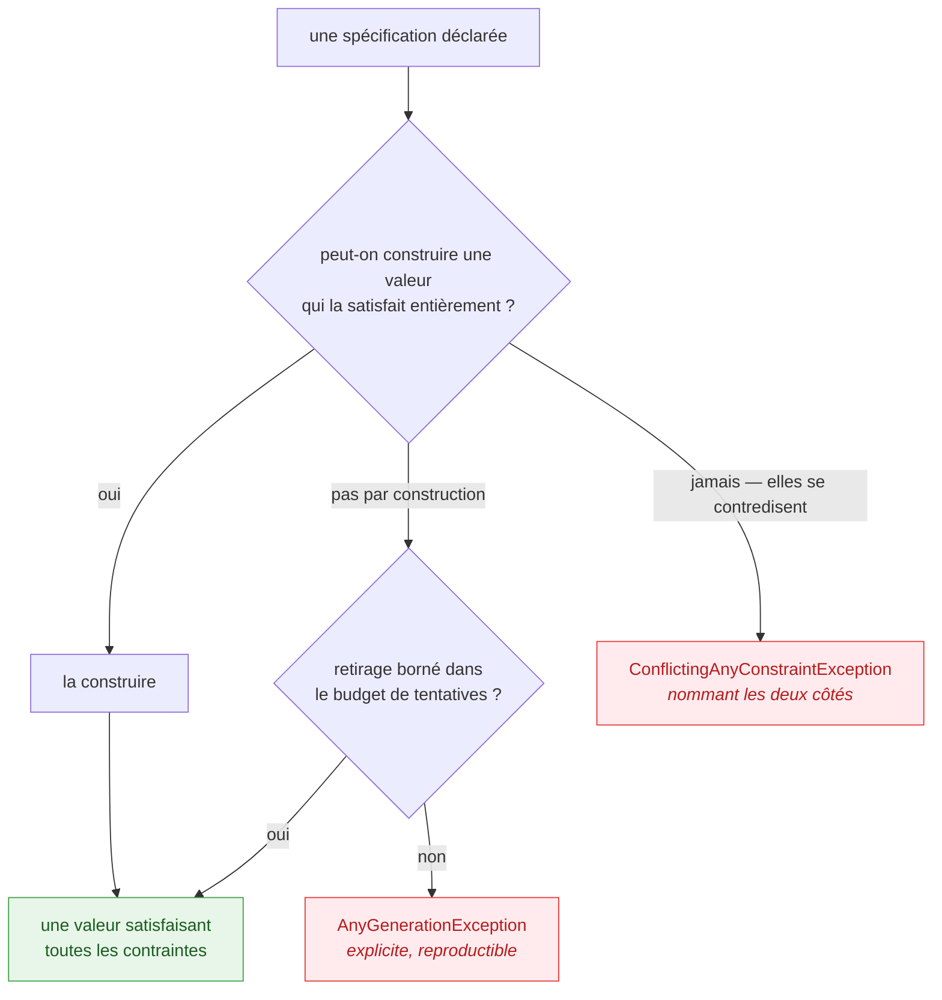

Toute bibliothèque refuse quelque chose. La plupart le font par accident et s'en excusent dans le
gestionnaire de tickets. JustDummies le fait exprès et écrit la frontière noir sur blanc. Cette page
explique où passe cette frontière, pour que vous puissiez décider si c'est la bonne bibliothèque
pour vous — et pour que ses refus cessent de ressembler à des manques.

## « Just dummies » est un périmètre, pas un slogan

Le nom est la spécification. Un dummy est une valeur arbitraire et **valide pour les contraintes
déclarées sur le site d'appel**. Ce n'est pas un tirage statistiquement idéal, ni un générateur
universel, ni un solveur de contraintes.

C'est plus étroit que ce que ce pourrait être, volontairement. Le travail de la bibliothèque est de
faire dire à un test ce qu'il veut dire et de le garder reproductible ; tout le reste dispute le
même budget de complexité et se paie en surprises.

## Borner l'ambition, jamais la correction

La règle que suit toute la conception a deux moitiés, et les deux comptent
([ADR-0046](https://github.com/Reefact/just-dummies/blob/lib-v1.0.0-preview.3/doc/handwritten/for-maintainers/adr/0046-bound-the-generators-ambition-never-its-correctness.fr.md)) :

* **Ambition bornée.** Il y a une limite à ce que le générateur *tente*.
* **Correction non bornée.** Il n'y a aucune limite à ce qu'il *garantit* une fois qu'il tente. Une
  valeur tirée satisfait toutes les contraintes déclarées — toujours, sans « en général » attaché.

Ainsi, quand un cas sort de ce que la bibliothèque tente, la réponse est un refus clair nommant ce
qui ne peut pas être honoré. Ce n'est jamais une valeur produite par un mécanisme sur lequel
personne ne peut raisonner.



## Les bornes, et la raison de chacune

| Borne | Ce que c'est | Pourquoi |
| --- | --- | --- |
| `Any.Combine` s'arrête à huit | aucune surcharge ne prend neuf générateurs | un type réclamant neuf entrées indépendantes appelle une structure intermédiaire ; la composer est à la fois le contournement et la meilleure conception ([ADR-0005](https://github.com/Reefact/just-dummies/blob/lib-v1.0.0-preview.3/doc/handwritten/for-maintainers/adr/0005-cap-any-combine-at-arity-eight.fr.md)) |
| `Any.StringMatching` analyse un sous-ensemble **régulier** | les constructions non régulières sont refusées nommément | élargir signifierait une dépendance à un automate d'expressions régulières ; un refus nommé vaut mieux qu'une dépendance cachée ([ADR-0008](https://github.com/Reefact/just-dummies/blob/lib-v1.0.0-preview.3/doc/handwritten/for-maintainers/adr/0008-generate-strings-from-a-home-grown-regular-subset.fr.md)) |
| les retirages sont **bornés** | collections distinctes, exclusions de chaînes et correspondance d'expressions régulières tentent un nombre fixe de fois | une boucle qui pourrait ne pas finir est pire qu'un échec qui s'explique toujours ([ADR-0004](https://github.com/Reefact/just-dummies/blob/lib-v1.0.0-preview.3/doc/handwritten/for-maintainers/adr/0004-gate-distinct-collections-by-cardinality-else-bounded-draw.fr.md), [ADR-0027](https://github.com/Reefact/just-dummies/blob/lib-v1.0.0-preview.3/doc/handwritten/for-maintainers/adr/0027-guarantee-a-generated-regex-value-matches-by-bounded-redraw.fr.md)) |
| les tailles s'arrêtent à un million | une longueur ou un effectif au-dessus de 1 000 000 est refusé | on a dépassé le point où un test voulait un dummy pour entrer dans celui où il voulait un test de charge ([ADR-0029](https://github.com/Reefact/just-dummies/blob/lib-v1.0.0-preview.3/doc/handwritten/for-maintainers/adr/0029-let-a-size-maximum-cap-without-steering-the-draw.fr.md)) |
| le flottant reste ordinaire | un `double`, `float` ou `decimal` non contraint est tiré dans un ordre de grandeur d'un million | des tirages couvrant toute la plage du type produisent des valeurs qu'aucun domaine ne porte, et une arithmétique sur laquelle personne ne peut affirmer quoi que ce soit ([ADR-0031](https://github.com/Reefact/just-dummies/blob/lib-v1.0.0-preview.3/doc/handwritten/for-maintainers/adr/0031-draw-arbitrary-numbers-within-an-ordinary-magnitude.fr.md)) |

Aucune de ces bornes n'est une limitation temporaire attendant que quelqu'un trouve le temps. Chacune
est une décision dont le raisonnement est consigné, et chacune peut être réexaminée — en changeant la
décision, pas en la contournant.

## Un refus est une fonctionnalité

L'alternative au refus est la devinette, et deviner coûte cher à un endroit censé être ennuyeux. Un
générateur qui renvoie discrètement *quelque chose* alors que la spécification était impossible a
déplacé l'échec de la ligne d'arrangement, où il est évident, vers l'assertion, où il ressemble à un
défaut de votre code.

Une contradiction est donc refusée là où elle est déclarée, avec un message nommant **les deux**
côtés :

<!-- jd:allow=JD015 -->
```csharp
// Refusé, et le message dit quelles deux contraintes se contredisent.
string impossible = Any.String().StartingWith("ORDER-").WithLength(3).Generate();
```

Ce message fait partie du produit. Un conflit se contentant de dire « aucune valeur n'est possible »
vous laisserait bissecter une chaîne à la main.

## Ce que cela change au quotidien

**Vous devrez parfois faire quelque chose à la main.** Un motif hors du sous-ensemble régulier, un
agrégat à quinze champs, une valeur dont la validité dépend d'une autre valeur tirée plus tôt. La
bibliothèque vous donne `IAny<T>`, `.As(...)` et `Combine`, et attend de vous que vous assembliez le
reste — ce qui garde le résultat correct selon *vos* règles plutôt que selon une convention devinée.

**Vous n'aurez pas à déboguer le générateur.** Chaque refus nomme ce qu'il n'a pas pu honorer, chaque
tirage satisfait ce que vous avez déclaré, et toute exécution séquentielle se rejoue depuis la graine
qu'elle rapporte. Quand un test utilisant des dummies passe au rouge, le défaut est dans le code
testé.

**Une fonctionnalité absente est une décision qui se lit.** Si quelque chose que vous attendiez n'est
pas là, la raison est écrite dans la base de décisions plutôt que perdue dans un message de commit —
ce qui la rend aussi discutable. Ouvrez un ticket et citez l'ADR.
