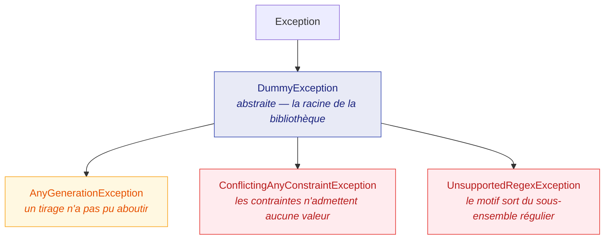

JustDummies préfère refuser bruyamment plutôt que renvoyer une valeur que personne ne saurait
expliquer. Cette page décrit ce qu'elle refuse, ce que signifient les exceptions, et comment lire un
message qui nomme les deux côtés d'une contradiction.

## La hiérarchie d'exceptions



`DummyException` est abstraite : l'attraper attrape donc tout ce que cette bibliothèque lève, et
rien d'autre :

<!-- jd:allow=JD023 -->
```csharp
try {
    int impossible = Any.Int32().Between(1, 10).MultipleOf(50).Generate();
} catch (DummyException exception) {
    Console.Error.WriteLine(exception.Message);
}
```

Les erreurs d'argument ordinaires ne font **pas** partie de cette hiérarchie. Passer `null` là où un
générateur est attendu, ou une longueur négative, lève les habituelles `ArgumentNullException` /
`ArgumentException` — ce sont des bogues du code appelant, pas des affirmations sur un jeu de
contraintes.

## `ConflictingAnyConstraintException` : aucune valeur possible

C'est celle que vous rencontrerez le plus, et c'est une fonctionnalité, non un défaut. Parce que les
valeurs sont construites pour satisfaire toute la spécification au lieu d'être tirées puis filtrées,
une spécification qui ne satisfait rien est détectée au lieu d'être parcourue en boucle :

<!-- jd:allow=JD023 -->
```csharp
// Aucun entier n'est à la fois supérieur à 100 et inférieur à 10.
int impossible = Any.Int32().GreaterThan(100).LessThan(10).Generate();
```

**Le message nomme les deux côtés du conflit.** C'est une garantie du produit, non un hasard de
formulation : un message se contentant de dire « aucune valeur n'est possible » vous laisserait
relire une chaîne de douze appels pour trouver lesquels se contredisent.

Les conflits prennent quelques formes reconnaissables :

| Forme | Exemple |
| --- | --- |
| bornes qui se croisent | `.GreaterThan(100).LessThan(10)` |
| un treillis sans point dans l'intervalle | `.Between(1, 10).MultipleOf(50)` |
| des exclusions qui vident le domaine | `Any.Boolean().Except(true, false)` |
| une longueur trop courte pour les fragments | `.StartingWith("ORDER-").WithLength(3)` |
| un effectif qu'aucun vivier ne peut remplir | 100 valeurs distinctes depuis un vivier de trois |

## Attrapés à la compilation

Beaucoup de ces chaînes sont décidables à partir de constantes que le compilateur voit déjà, et les
analyzers embarqués dans le paquet les signalent **avant** que le test ne s'exécute. C'est la
différence entre un build rouge et un test rouge à trois heures du matin :

| Règle | Détecte |
| --- | --- |
| [JD014](/fr/docs/analyzers/JD014/) | un argument constant que la garde du générateur refuse |
| [JD015](/fr/docs/analyzers/JD015/) | une chaîne de caractères qui lève : fragments trop longs, ou value set vidé par une contrainte |
| [JD016](/fr/docs/analyzers/JD016/) | des effectifs de collection incompatibles entre eux |
| [JD017](/fr/docs/analyzers/JD017/) | une contrainte d'énumération sortant des membres déclarés |
| [JD023](/fr/docs/analyzers/JD023/) | une chaîne entière réduite à rien |
| [JD024](/fr/docs/analyzers/JD024/) | une contrainte qui ne restreint rien du tout |

Les vérifications à l'exécution restent en place dans tous les cas : elles couvrent tout argument
qu'un analyzer ne peut pas voir — calculé, lu dans un champ, ou reçu en paramètre.

## `AnyGenerationException` : un tirage qui n'a pas abouti

Quelques contraintes ne peuvent pas être honorées par construction. Exclure des valeurs d'un
intervalle continu, satisfaire une expression régulière et remplir une collection d'éléments
distincts aboutissent au même endroit : tirer un candidat, le vérifier, recommencer s'il ne convient
pas.

Sans borne, c'est une boucle qui peut ne jamais finir. JustDummies la borne — un nombre fixe de
tentatives, puis un refus :

```csharp
// Deux décimales entre 0 et 1 laissent 101 candidats ; en exclure 100 n'en laisse qu'un.
decimal[] excluded = Enumerable.Range(0, 100).Select(index => index / 100m).ToArray();

try {
    decimal awkward = Any.Decimal().Between(0m, 1m).WithScale(2).Except(excluded).Generate();
} catch (AnyGenerationException exception) {
    // exception.Seed porte la graine de l'exécution, si une graine était épinglée — l'échec se rejoue donc.
    Console.Error.WriteLine($"{exception.Message} (seed: {exception.Seed})");
}
```

`AnyGenerationException` porte une propriété `Seed` nullable. Quand le tirage a eu lieu dans une
portée reproductible, la graine qui l'a produit figure sur l'exception : un échec de retirage borné
est donc aussi rejouable que n'importe quel autre échec.

En rencontrer un signifie généralement que la spécification est plus serrée que prévu, et non que la
bibliothèque a abandonné trop tôt. Élargissez l'intervalle, retirez une exclusion, ou demandez moins
d'éléments distincts.

## `UnsupportedRegexException` : hors du sous-ensemble régulier

`Any.StringMatching` construit une valeur à partir du motif au lieu de tester des candidats contre
lui, et c'est pourquoi il peut garantir la correspondance. Construire exige que le motif soit
**régulier**, et la bibliothèque le dit plutôt que de deviner :

```csharp
try {
    // Une référence arrière n'est pas une construction régulière : aucun automate fini ne la porte.
    string impossible = Any.StringMatching(@"(\w+)\s\1").Generate();
} catch (UnsupportedRegexException exception) {
    Console.Error.WriteLine(exception.Message);
}
```

Les constructions acceptées — et celles refusées — sont listées dans
[Chaînes et motifs](/fr/docs/generators/strings/). La décision d'analyser un sous-ensemble régulier
avec l'analyseur syntaxique de la bibliothèque, plutôt que de prendre une dépendance à un automate
d'expressions régulières pour élargir la couverture, est
[ADR-0008](https://github.com/Reefact/just-dummies/blob/lib-v1.0.0-preview.3/doc/handwritten/for-maintainers/adr/0008-generate-strings-from-a-home-grown-regular-subset.fr.md).

## Symptôme, cause, remède

| Symptôme | Cause probable | Remède |
| --- | --- | --- |
| `ConflictingAnyConstraintException` à la ligne d'arrangement | deux contraintes se contredisent | lisez le message — il nomme les deux — et retirez celle qui n'est pas un invariant du domaine |
| `AnyGenerationException` après une pause | un retirage borné a épuisé ses tentatives | élargissez le domaine, ou demandez moins de valeurs distinctes |
| `UnsupportedRegexException` | le motif utilise une construction non régulière | réécrivez-le dans le sous-ensemble régulier, ou construisez la chaîne avec les contraintes d'`Any.String()` |
| une valeur que votre fabrique refuse | les contraintes sont plus lâches que la fabrique | resserrez les contraintes jusqu'à ce qu'elles impliquent le contrat de la fabrique |
| un test qui passe à la relance | les valeurs en échec ont disparu | enveloppez le corps dans `Any.Reproducibly` pour que le prochain échec nomme sa graine |
| un avertissement de build `JD0NN` | une erreur décidable à la compilation | ouvrez la page de règle liée depuis le diagnostic |
