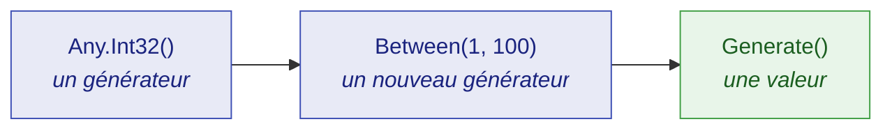

Dix minutes entre un projet de test vide et un test qui se lit mieux, couvre davantage, et indique
exactement comment le rejouer quand il passe au rouge. Aucune connaissance préalable des générateurs
de dummies n'est supposée.

## Qu'est-ce qu'un dummy ?

Un **dummy** est une valeur dont un test a besoin, mais dont il ne se soucie pas.

Tout test en contient. Un test sur les remises a besoin d'une référence de commande, mais n'importe
laquelle fera l'affaire. Un test sur la livraison a besoin d'un nom de client, mais ce nom n'a aucune
importance. Traditionnellement, ces valeurs sont saisies à la main :

```csharp
string reference = "ORD-12345678";
int    quantity  = 3;
```

Un littéral choisi à la main pose deux problèmes précis.

Le premier : il **ment sur ce qui compte**. Un lecteur ne peut pas savoir si `3` est essentiel au
test ou si `7` conviendrait tout aussi bien. Chaque littéral a l'air également porteur de sens,
personne n'ose donc en changer un, et le test devient plus difficile à lire que le code qu'il
couvre.

Le second : il **ne teste jamais qu'un seul cas**. `"ORD-12345678"` n'a jamais de zéro en tête,
jamais de caractère répété, et vaut toujours exactement cela. Un défaut qui demande une autre forme
d'entrée est un défaut que ce test ne trouvera jamais.

JustDummies remplace le littéral par une **déclaration de ce que la valeur doit satisfaire** :

```csharp
string reference = Any.String().StartingWith("ORD-").WithLength(12).Generate();
int    quantity  = Any.Int32().Between(1, 100).Generate();
```

Le test dit désormais ce qu'il veut dire. La référence doit commencer par `ORD-` et faire douze
caractères parce que *c'est cela, une référence de commande* — et tout le reste est libre de varier.

## Installation

```bash
dotnet add package JustDummies
```

C'est toute l'installation. Le paquet embarque aussi ses 33 règles d'analyzer, si bien que les garde-fous du
bon usage se mettent à travailler dès la compilation suivante, sans rien configurer de plus.

## Votre premier dummy

```csharp
int      quantity  = Any.Int32().Between(1, 100).Generate();
string   name      = Any.String().Alpha().WithLengthBetween(3, 20).Generate();
Guid     id        = Any.Guid().NonEmpty().Generate();
DateTime orderedAt = Any.DateTime().Before(new DateTime(2030, 1, 1)).Generate();
```

Chaque ligne suit la même structure en trois temps, et il vaut la peine de nommer ces temps : tout
le reste de la bibliothèque n'en est qu'une déclinaison.



1. **`Any.Int32()` ouvre un générateur.** Un générateur est une *recette* — la description des
   valeurs qui seraient acceptables. Ce n'est pas une valeur, et aucune valeur n'a encore été tirée.
2. **`.Between(1, 100)` ajoute une contrainte.** Elle ne modifie pas le générateur : elle en renvoie
   un **nouveau**, porteur d'une exigence de plus. L'original reste intact.
3. **`.Generate()` tire une valeur.** C'est la seule étape qui produit quelque chose de concret, et
   la seule où intervient le hasard.

Le deuxième point est celui sur lequel les débutants butent ; autant le voir directement :

```csharp
AnyInt32 anyQuantity = Any.Int32().Between(1, 100);

// Ajouter une contrainte renvoie un NOUVEAU générateur ; anyQuantity signifie toujours « 1 à 100 ».
AnyInt32 anyEvenQuantity = anyQuantity.MultipleOf(2);

int     quantity = anyQuantity.Generate();     // 1..100, pair ou impair
int evenQuantity = anyEvenQuantity.Generate(); // 1..100, pair
```

Parce qu'un générateur est immuable, on peut sans risque en conserver un dans un champ, le faire
circuler, et en dériver des variantes sans qu'aucune n'interfère avec les autres.

## Un vrai test, avant et après

Voici un test ordinaire pour une règle de remise. La règle est simple : appliquer un pourcentage de
remise à un montant ne doit jamais produire un prix négatif.

Écrit avec des littéraux, il vérifie exactement un cas arithmétique :

<!-- jd:declarations -->
```csharp
public sealed class DiscountTests {

    [Fact]
    public void A_discount_never_produces_a_negative_price() {
        decimal amount     = 100m;
        int     percentage = 20;

        decimal discounted = Discount.Apply(amount, percentage);

        Assert.Equal(80m, discounted);
    }

}

internal static class Discount {

    public static decimal Apply(decimal amount, int percentage) {
        return amount - (amount * percentage / 100m);
    }

}
```

Le nom du test promet quelque chose sur *toutes* les remises ; le corps en livre une. Rien ici ne
remarquerait une règle qui casse à 100 %, ou pour un montant nul.

Écrit avec des dummies, le corps dit enfin ce que le nom annonce :

<!-- jd:declarations -->
```csharp
public sealed class DiscountTests {

    [Fact]
    public void A_discount_never_produces_a_negative_price() {
        // Un montant de commande est positif ou nul et porte deux décimales : c'est le domaine,
        // pas l'assertion. Un pourcentage va de 0 à 100 pour la même raison.
        decimal amount     = Any.Decimal().Between(0m, 10_000m).WithScale(2).Generate();
        int     percentage = Any.Int32().Between(0, 100).Generate();

        decimal discounted = Discount.Apply(amount, percentage);

        Assert.InRange(discounted, 0m, amount);
    }

}

internal static class Discount {

    public static decimal Apply(decimal amount, int percentage) {
        return amount - (amount * percentage / 100m);
    }

}
```

Relisez le commentaire de cet exemple : c'est l'habitude la plus importante de toute la
bibliothèque.

> **Une contrainte énonce un invariant du domaine. Elle ne redit jamais ce que le test affirme.**

Le montant est contraint positif ou nul parce que *les montants le sont*, et non parce que
l'assertion échouerait sinon. Si vous vous surprenez à ajouter une contrainte pour faire passer une
assertion, la contrainte n'est pas à sa place — et le plus souvent, l'assertion vient de trouver un
vrai défaut.

## Rendre un échec reproductible

Un test qui tire une valeur différente à chaque exécution est plus puissant qu'un test qui n'en tire
qu'une — et il n'est acceptable que si un échec peut être rejoué à l'identique. C'est le rôle de
`Any.Reproducibly` :

```csharp
Any.Reproducibly(() => {
    decimal amount     = Any.Decimal().Between(0m, 10_000m).WithScale(2).Generate();
    int     percentage = Any.Int32().Between(0, 100).Generate();

    Assert.InRange(amount - (amount * percentage / 100m), 0m, amount);
});
```

Pendant l'exécution du corps, tous les tirages proviennent d'une seule graine épinglée. Si le corps
lève une exception, la graine est rapportée avant que l'échec ne se propage :

```text
[JustDummies] These arbitrary values were seeded with 1743029518. Reproduce this run with Any.Reproducibly(1743029518, ...).
```

Recopiez ce nombre devant le corps. Rien d'autre ne bouge — même test, un argument de plus — et
l'exécution exacte revient, valeur pour valeur :

```csharp
Any.Reproducibly(1743029518, () => {
    // les mêmes tirages que l'exécution qui a échoué
});
```

Déboguez sur ces valeurs exactes, corrigez le défaut, puis supprimez la graine pour que le test
recommence à varier.

Avec xUnit v3, le paquet [`JustDummies.Xunit`](/fr/docs/packages/justdummies-xunit/) fait cela pour
vous via un attribut `[Reproducible]` : aucun corps de test n'a besoin d'être enveloppé à la main.

## Et ensuite

| Pour… | Lire |
| --- | --- |
| bien comprendre les générateurs avant d'aller plus loin | [Concepts fondamentaux](/fr/docs/guides/core-concepts/) |
| rejouer une exécution en échec, ou épingler une graine | [Reproductibilité](/fr/docs/guides/reproducibility/) |
| construire un dummy pour *vos* types | [Composition](/fr/docs/guides/composition/) |
| savoir ce qui arrive quand des contraintes se contredisent | [Erreurs et conflits](/fr/docs/guides/errors-and-conflicts/) |
| retrouver toutes les contraintes d'un type donné | [Référence des générateurs](/fr/docs/generators/) |
| comprendre pourquoi la bibliothèque refuse certaines choses volontairement | [Principes de conception](/fr/docs/guides/design-principles/) |
| obtenir une réponse courte à une question précise | [FAQ](/fr/docs/guides/faq/) |
