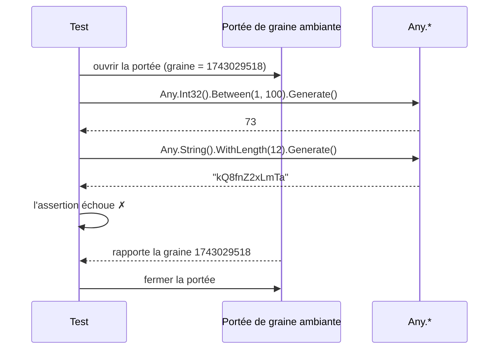
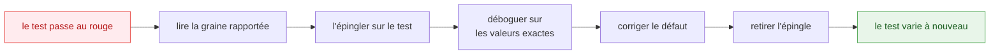

Un test qui tire une valeur différente à chaque exécution trouve des défauts qu'un test figé ne
trouverait jamais — et il ne vaut la peine que si un échec peut être rejoué à l'identique. Cette
page décrit le mécanisme qui rend cela vrai, et les quatre façons d'y accéder.

## Pourquoi des valeurs arbitraires ont besoin d'un bouton « rejouer »

L'objection faite aux valeurs aléatoires dans les tests est légitime : *un test qui échoue une fois
et passe à la relance est pire que pas de test du tout.* Il coûte une après-midi et apprend à
l'équipe à appuyer sur « réessayer ».

JustDummies y répond en rendant chaque exécution **rejouable à partir d'un seul entier**. Les
tirages proviennent d'une source aléatoire ambiante épinglée à une graine. Faites varier la graine
et la suite explore ; rapportez la graine en cas d'échec et n'importe quelle exécution revient
exactement.



La graine n'est rapportée **que si l'exécution échoue**. Une suite verte reste silencieuse.

## `Any.Reproducibly` : une portée épinglée par test

Enveloppez le corps d'un test et tout ce qui est tiré à l'intérieur provient d'une seule graine :

```csharp
Any.Reproducibly(() => {
    decimal amount     = Any.Decimal().Between(0m, 10_000m).WithScale(2).Generate();
    int     percentage = Any.Int32().Between(0, 100).Generate();

    Assert.InRange(amount - (amount * percentage / 100m), 0m, amount);
});
```

Si le corps lève une exception, la graine est écrite et l'exception d'origine se propage inchangée —
l'échec que vous voyez reste celui de votre assertion, avec la graine à côté :

```text
[JustDummies] These arbitrary values were seeded with 1743029518. Reproduce this run with Any.Reproducibly(1743029518, ...).
```

Par défaut, le rapport part vers `Console.Error`. Passez un second argument pour l'envoyer ailleurs
— par exemple vers la sortie d'un framework de test :

```csharp
Any.Reproducibly(
    () => Assert.True(Any.Int32().Positive().Generate() > 0),
    report: message => Console.Out.WriteLine(message));
```

## Rejouer un échec

Prenez le nombre du rapport, passez-le à la surcharge avec graine, et l'exécution revient valeur
pour valeur :

```csharp
Any.Reproducibly(1743029518, () => {
    decimal amount     = Any.Decimal().Between(0m, 10_000m).WithScale(2).Generate();
    int     percentage = Any.Int32().Between(0, 100).Generate();

    Assert.InRange(amount - (amount * percentage / 100m), 0m, amount);
});
```

La boucle de travail est courte, et la dernière étape compte autant que la première :



**Retirez l'épingle une fois le défaut corrigé.** Une graine laissée dans le dépôt retransforme le
test en test à un seul cas — précisément ce que les dummies servaient à fuir. Un analyzer optionnel
existe pour cela, [JD019](/fr/docs/analyzers/JD019/), qui signale une graine de rejeu constante dans
le code versionné ; activez-le dans `.editorconfig` si les épingles ont tendance à survivre à la
revue dans votre équipe.

## Corps asynchrones

Un corps `async` demande `ReproduciblyAsync`, et la tâche renvoyée **doit** être attendue :

```csharp
await Any.ReproduciblyAsync(async () => {
    string reference = Any.String().StartingWith("ORD-").WithLength(12).Generate();

    await Task.Delay(1);

    Assert.StartsWith("ORD-", reference);
});
```

Se tromper ici est silencieux de la pire façon ; deux analyzers le gardent donc en **erreur** :
passer une lambda `async` au `Any.Reproducibly` synchrone est [JD001](/fr/docs/analyzers/JD001/) —
liée à une `Action`, elle devient `async void` et ses échecs d'assertion n'atteignent jamais le
lanceur de tests — et jeter la tâche renvoyée par `ReproduciblyAsync` est
[JD002](/fr/docs/analyzers/JD002/).

## `Any.UseSeed` : la forme à portée

Quand le code à épingler ne peut pas être enveloppé dans un délégué, ouvrez une portée et libérez-la
à la fin :

```csharp
using (IDisposable scope = Any.UseSeed(1743029518)) {
    int quantity = Any.Int32().Between(1, 100).Generate();

    Assert.InRange(quantity, 1, 100);
}
```

C'est la forme qu'utilise un adaptateur de framework de test, car il observe un test via des crochets
qui s'exécutent avant et après lui. Elle ne rapporte **pas** la graine en cas d'échec — c'est le rôle
de `Reproducibly` — donc dans un corps de test, préférez `Reproducibly`.

Jeter la poignée laisse la graine épinglée pour ce qui s'exécute ensuite, d'où le diagnostic
[JD004](/fr/docs/analyzers/JD004/). Une seconde surcharge prend le **fragment de rejeu** qu'un
adaptateur veut voir figurer dans les conseils d'échec, pour que le message nomme le code que le
lecteur doit réellement modifier :

```csharp
using (IDisposable scope = Any.UseSeed(1743029518, "[Reproducible(Seed = 1743029518)]")) {
    Assert.True(Any.Int32().Positive().Generate() > 0);
}
```

## `Any.WithSeed` : un contexte isolé

`Any.WithSeed(seed)` n'épingle rien d'ambiant. Il renvoie un `AnyContext` — un monde autonome
portant les mêmes fabriques — ce qu'il faut pour construire des données déterministes *en dehors*
d'un corps de test, comme une fixture ou un benchmark :

```csharp
AnyContext context = Any.WithSeed(1743029518);

int      quantity  = context.Int32().Between(1, 100).Generate();
string   reference = context.String().StartingWith("ORD-").WithLength(12).Generate();
int      seed      = context.Seed;

// La même graine reconstruit exactement les mêmes données, où que cela s'exécute.
```

Parce que le contexte est isolé, les valeurs qui en sont tirées ne subissent aucune portée ambiante
— et ni un attribut `[Reproducible]` ni un `Any.Reproducibly` englobant ne les gouvernent.

Conserver un `AnyContext` dans un champ **statique** est un piège qui mérite d'être nommé : des
tirages entrelacés depuis plusieurs tests ne rendent stables ni la séquence ni le multiensemble,
c'est le diagnostic [JD020](/fr/docs/analyzers/JD020/).

## Avec xUnit v3 : `[Reproducible]`

Le paquet [`JustDummies.Xunit`](/fr/docs/packages/justdummies-xunit/) supprime complètement
l'enveloppe :

<!-- jd:declarations -->
```csharp
public sealed class DiscountTests {

    [Fact, Reproducible]
    public void A_discount_never_produces_a_negative_price() {
        decimal amount     = Any.Decimal().Between(0m, 10_000m).WithScale(2).Generate();
        int     percentage = Any.Int32().Between(0, 100).Generate();

        Assert.InRange(amount - (amount * percentage / 100m), 0m, amount);
    }

}
```

L'attribut épingle une graine fraîche pour chaque **cas** de test — chaque cas d'une `[Theory]` a
donc la sienne au lieu d'en partager une — et écrit la graine dans la sortie du test quand, et
seulement quand, le test échoue :

```text
[JustDummies] These arbitrary values were seeded with 1743029518. Reproduce this run with [Reproducible(Seed = 1743029518)].
```

Pour rejouer, épinglez la graine sur l'attribut : `[Reproducible(Seed = 1743029518)]`. L'attribut
s'applique aussi à une classe ou à un assembly entier ; quand plusieurs niveaux s'appliquent, le
plus spécifique l'emporte pendant la durée du test et les niveaux extérieurs sont restaurés ensuite.

## Ce que promet une graine

Depuis `1.0.0-preview.1`, une graine donnée tire **les mêmes valeurs sur chaque version corrective
et mineure d'une version majeure**, et un golden master de la suite de tests le vérifie
([ADR-0049](https://github.com/Reefact/just-dummies/blob/lib-v1.0.0-preview.3/doc/handwritten/for-maintainers/adr/0049-replay-a-seed-across-patch-and-minor-versions.fr.md)).
Une graine notée aujourd'hui reste rejouable après une montée de version dans la même majeure.

Deux limites méritent d'être énoncées clairement.

**Le rejeu vaut par exécution séquentielle.** Les tirages sont sérialisés sur la source aléatoire :
une graine rejoue donc une exécution dont les tirages surviennent dans un ordre déterministe. Des
tâches exécutées en parallèle dans une même portée entrelacent leurs tirages, et l'ordre — donc les
valeurs — n'est pas stable d'une exécution à l'autre. Donnez à chaque tâche parallèle sa propre
portée de graine ; tirer sans elle est le diagnostic [JD022](/fr/docs/analyzers/JD022/).

**Une graine est un identifiant, pas une assertion.** Elle existe pour faire revenir une exécution.
N'affirmez jamais quoi que ce soit sur une graine, et ne construisez jamais d'attente de test à
partir d'une graine.
